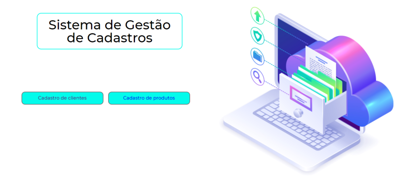

# Desafio 2 Gama Academy - Hiring Coders/VTEX
  Desafio realizado para o projeto Hiring Coders\#2 - VTEX realizado pela Gama Academy

## Criação de um sistema e-commerce para inventário de produtos e dados de clientes
- Dados guardado no localStorage,
- Campos de input de datas com validação,  
- Campos de input com mascaras: 
  - senha,
  - CPF,
  - telefone,
  - CEP,
- Botão de cadastro com mudança de status (texto),
- Campo Nome completo  e Nome do produto, após primeiro cadastro que esta com foco muda o texto do botão de cadastro para "Cadastrar novo produto",
- Ícone de Home para voltar para página inicial.
  
## Página Inicial
  

## Página de cadastro de clientes
  

  ## Página de cadastro de produtos
  
